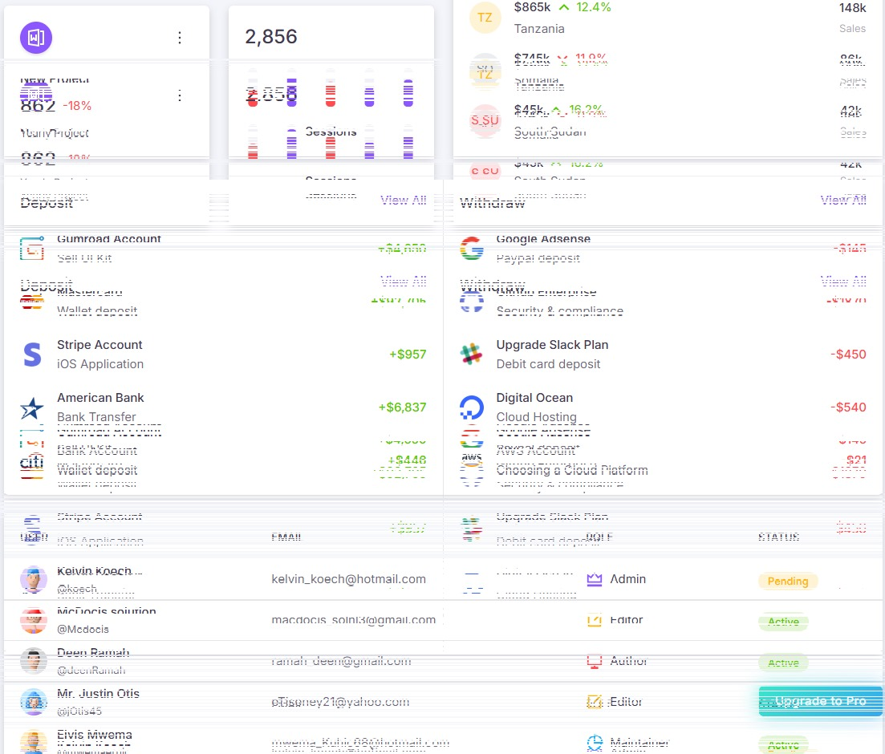

# 🧠 Deen Admin Dashboard (Next.js)

[](https://nextjs.org/)
[](https://www.typescriptlang.org/)
[](https://tailwindcss.com/)
[](LICENSE)

> ✨ Admin dashboard crafted with 💖 using Next.js App Router, Tailwind CSS, and modern UI practices.

---

## 📸 Preview

> _Take a sneak peek at the dashboard UI in action below._

| Dashboard Home | User Management | Settings Panel | Dark Mode |
|----------------|------------------|----------------|-----------|
|  |  |  |  |

> _Replace the placeholder images in `./public/screenshots/` with your own screenshots._

---

## 🚀 Getting Started

### 🧬 Clone the Repository

```bash
git clone https://github.com/DeenRamah/deen-admin-js.git
cd deen-admin-js
```

### 📦 Install Dependencies

Using **npm**:

```bash
npm install
```

Or with **yarn**:

```bash
yarn install
```

Or with **pnpm**:

```bash
pnpm install
```

### 🔧 Run in Development

```bash
npm run dev
```

Open your browser at [http://localhost:3000](http://localhost:3000) to see the dashboard.

---

## ✨ Features

- ⚡ Blazing-fast Next.js (App Router)
- 🎨 Tailwind CSS with custom themes
- 🌙 Light/Dark Mode Toggle
- 🧑‍💼 Admin UI with user and settings management
- ⚙️ Extensible component structure
- 📱 Fully responsive design

---

## 🛠️ Project Structure

```bash
deen-admin-js/
├── app/                  # Next.js app directory
│   └── page.tsx          # Main dashboard page
├── components/           # Reusable UI components
├── public/screenshots/   # Screenshot images for README
├── styles/               # Tailwind config and globals
├── .env.local            # Local environment variables
├── next.config.js        # Next.js configuration
├── tailwind.config.js    # Tailwind theme customization
└── README.md             # You're here!
```

---

## 📦 Deploy on Vercel

The easiest way to deploy this project is on **[Vercel](https://vercel.com/)**:

[](https://vercel.com/new/project?template=DeenRamah/deen-admin-js)

Or follow the [Next.js Deployment Docs](https://nextjs.org/docs/deployment) to set it up manually.

---

## 📚 Learn More

- [Next.js Documentation](https://nextjs.org/docs)
- [Tailwind CSS Docs](https://tailwindcss.com/docs)
- [TypeScript Docs](https://www.typescriptlang.org/docs/)

---

## 🧠 About

This project was built as part of the **VibeWithCode** challenge – tackling admin systems with modern frontend architecture and futuristic design thinking. 

Crafted by [Deen Ramah](https://github.com/DeenRamah) 💻

---

## 🪪 License

This project is licensed under the **MIT License**. See [`LICENSE`](./LICENSE) for details.
